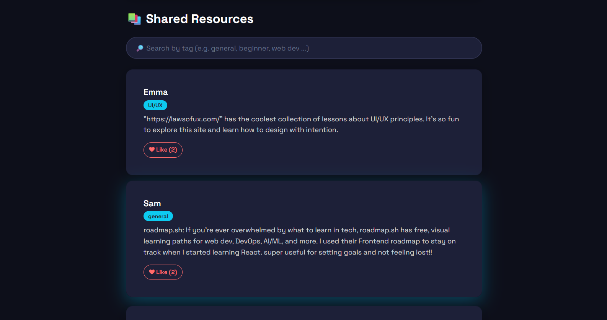

# 💻 CS Resource Forum
`Python` `Flask` `AWS EC2` `JavaScript` `HTML` `Bootstrap 5` `CSS` `Postman`

A simple but powerful API + front-end web app that allows students to **share and discover helpful Computer Science resources**. Built with **Flask** and **vanilla JavaScript**, the project showcases full-stack capabilities and serves as a lightweight community forum.

#### Project Summary:
- A searchable resource sharing forum with full CRUD functionality
- RESTful API routes and JSON storage for posts
- Deployed to AWS EC2 here: http://3.145.3.180
- Implemented frontend search and like features with JavaScript


## 🚀 Features

- 🔄 Submit a post with your name, message, and topic tag
- ❤️ Give Likes to posts
- 🔍 Search posts by tag
- 🌐 API routes for posting, retrieving posts, liking, and searching
- 🎨 Stylish and responsive front-end using Bootstrap 5 and CSS


## 📂 Project Structure
```
project_folder/
│
├── app.py # Main Flask app
├── routes/
│ └── submit.py # Blueprint for post submission
├── utils/
│ └── storage.py # JSON read/write helpers
├── templates/
│ ├── index.html # Main feed
│ └── writePost.html # Submission form
└── data/
  └── posts.json # Stores all user posts
```


## 🧪 API Endpoints
| Method | Endpoint       | Description              |
|--------|----------------|--------------------------|
| GET    | `/posts`       | Returns all posts        |
| POST   | `/submit`      | Submit a new post (JSON) |
| POST   | `/like/<index>`| Increment like count     |

Example body for /submit:

```json
{
  "name": "Kayla",
  "tag": "beginner",
  "message": "CodePath is a great way to learn web dev!"
}
```

## ✨ Screenshots & GIFs
#### Main Demo
- view all posts
- like a post
- publish a post


#### Search Demo
- search for posts using their tags


#### More Screenshots
<div style="display: flex; flex-direction: column; gap: 10px;">
  
  
  
</div>

## License

    Copyright 2025 Kayla Sison

    Licensed under the Apache License, Version 2.0 (the "License");
    you may not use this file except in compliance with the License.
    You may obtain a copy of the License at

        http://www.apache.org/licenses/LICENSE-2.0

    Unless required by applicable law or agreed to in writing, software
    distributed under the License is distributed on an "AS IS" BASIS,
    WITHOUT WARRANTIES OR CONDITIONS OF ANY KIND, either express or implied.
    See the License for the specific language governing permissions and
    limitations under the License.